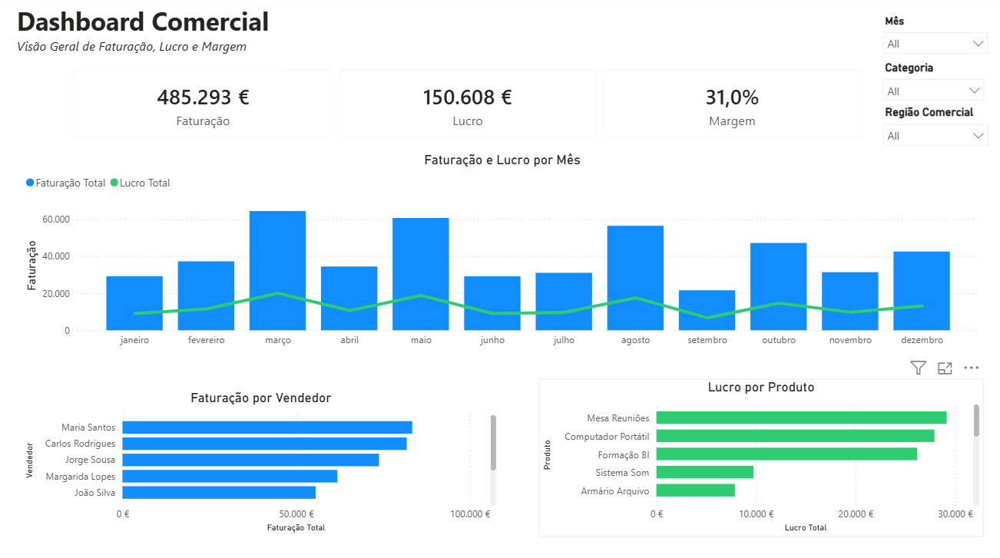

# dashboard-comercial-power-bi
Primeiro dashboard desenvolvido em Power BI durante o curso Data Analyst do CESAE Digital.


# Dashboard Comercial em Power BI

## Sobre o Projeto

Este é o primeiro projeto que desenvolvi em Power BI desde que iniciei a minha formação em Data Analyst no CESAE Digital.

O objetivo deste projeto foi transformar um conjunto de dados de vendas num dashboard simples, intuitivo e orientado para a tomada de decisão, aplicando boas práticas de visualização de dados e organização da informação.

O dashboard foi desenvolvido numa única página para permitir uma leitura rápida dos principais indicadores comerciais.

---

## Objetivo do Dashboard

Este dashboard procura responder rapidamente às seguintes questões:

- Qual foi a faturação total?
- Qual foi o lucro obtido?
- Qual foi a margem de lucro?
- Como evoluíram a faturação e o lucro ao longo dos meses?
- Quais os vendedores que mais contribuíram para a faturação?
- Quais os produtos que geraram maior lucro?

---

## Indicadores (KPIs)

### Faturação

Representa o valor total das vendas realizadas durante o período selecionado.

Foi escolhida por ser o principal indicador do volume de negócio, permitindo perceber rapidamente a dimensão das vendas.

### Lucro

Representa o resultado obtido após deduzir os custos à faturação.

Este indicador permite avaliar se o negócio está efetivamente a gerar retorno financeiro.

### Margem

Calculada através da relação entre o lucro e a faturação.

Foi incluída porque complementa os dois indicadores anteriores, permitindo avaliar a rentabilidade do negócio e colocar os resultados financeiros em contexto.

---

## Visualizações

### Faturação e Lucro por Mês

Foi utilizado um gráfico combinado (colunas e linha) para acompanhar a evolução mensal da faturação e do lucro, facilitando a identificação de tendências ao longo do tempo.

### Faturação por Vendedor

Foi utilizado um gráfico de barras horizontal para comparar rapidamente o desempenho dos vendedores e identificar quem mais contribuiu para a faturação.

### Lucro por Produto

Foi utilizado um gráfico de barras horizontal para identificar os produtos com maior impacto no lucro e analisar a rentabilidade do portefólio.

---

## Ferramentas Utilizadas

- Microsoft Power BI
- DAX (Data Analysis Expressions)
- Microsoft Excel

---

## Competências Desenvolvidas

Ao longo deste projeto coloquei em prática competências como:

- Modelação de dados
- Criação de medidas em DAX
- Desenvolvimento de KPIs
- Construção de dashboards
- Seleção de visualizações adequadas
- Organização do layout
- Data Storytelling
- Visualização de dados

---

## Dashboard

> Adicione uma captura de ecrã do dashboard nesta secção.

```markdown

```

---

## Aprendizagens

Sendo o meu primeiro projeto em Power BI, este trabalho permitiu consolidar conceitos fundamentais como:

- Criação de medidas em DAX.
- Construção de indicadores de desempenho (KPIs).
- Organização de dashboards de uma página.
- Aplicação de princípios de hierarquia visual.
- Escolha das visualizações mais adequadas para comunicar informação.

Este projeto marca o início do meu portefólio em Business Intelligence e representa o primeiro passo na minha aprendizagem em Power BI.

---

## Melhorias Futuras

Nos próximos projetos pretendo explorar funcionalidades mais avançadas, como:

- Power Query
- Modelação de dados mais complexa
- DAX avançado
- Tooltips personalizados
- Drill-through
- Bookmarks
- Dashboards com múltiplas páginas

---

## Autor

**Diogo Gomes**
